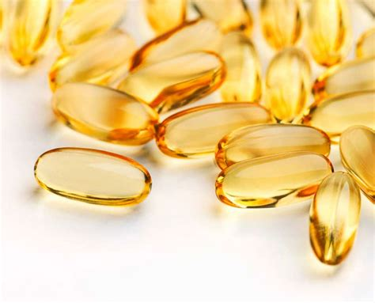

## Vitamin E

### Estrogen the enemy 

The association between estrogen and cancer had become known during this time, and vitamin E, which was originally known as the fertility vitamin, was soon recognized to have antiestrogenic properties, as well as to prevent the deadly effects of excessive polyunsaturated fats in the diet.

My endocrinology professor, A.S. Soderwall, who had found that excess estrogen prevented (or interrupted) pregnancy, demonstrated that increased vitamin E extended fertility in aging female rodents.

### PUFA

By the time I began my research, it seemed clear that it had been the reduction of PUFA in the diet which, like the addition of vitamin E, had prevented sterility in the calorie restriction experiments, and that those treatments had limited the effects of estrogen in the aging organisms.

### Sources of vitamin E

Vitamin E (extracted from wheat germ; more on that here). Another supplement that most people need is vitamin E. 

That’s going to limit the oxidation of PUFAs such as LA into mutagenic and carcinogenic metabolites.

The kind you want is the “dextro,” not the “levo” kind, and you want primarily alpha, including D-alpha-tocopherol

According to Dinkov, vitamin E has also been shown to have an antagonistic relationship with estrogen, which plays a significant role in many chronic diseases, including certain cancers.

The tocopherol isomers are also moderately strong aromatase inhibitors.

So, basically, by taking vitamin E, whatever estrogenic effects are out there, even from nonperoxidized PUFA, or if you're producing too much estrogen for whatever reason, if you have endocrine disruptors which are capable of binding and activating the estrogen receptor just like estrogen does, tocopherol will block some of that,” Dinkov says.

The daily needs have been shown to correlate perfectly with your intake and storage of PUFAs, so the daily need, the real RDA, of vitamin E is about 2 mg of vitamin E for every gram of PUFA consumed, which means, if you're consuming 50 grams of PUFA, you need 100 mg vitamin E to combat its peroxidative and estrogenic potential.

Most people are used to measuring the vitamin E in units.

If you take the vitamin E dosage in milligrams and multiply by 1.5, you get the dosage in international units.

Iron supplements and the use of supplemental oxygen, especially with a vitamin E deficiency exacerbated by excessive unsaturated fats in the diet, are still commonly used exactly when they can do the most damage.

T. Gunther and V. Hollriegl, "Increased protein oxidation by magnesium deficiency and vitamin E depletion," Magnesium-Bull. 16(3), 101-103, 1994.

### Protecting vitamin A

One of vitamin E's important functions is protecting vitamin A from destructive oxidation. Although little attention has been given to the effects of unsaturated fats on vitamin A, their destruction of vitamin E will necessarily lead to the destruction of vitamin A

### Brain protection

Soon after vitamin E was discovered, tocopherol was defined as a brain-protective, pregnancy protective, male fertility protective, antithrombotic, antiestrogenic agent. But very soon, the estrogen industry made it impossible to present ideas that explained vitamin E, progesterone, vitamin A, or thyroid hormone in terms of the protection they provide against estrogenic substances

Since the polyunsaturated fats caused the same conditions that were caused by unopposed estrogen, vitamin E came to be known as an "antioxidant," because it reduced their toxicity.

(Vitamin E is now known to suppress COX-2, synergizing with aspirin and opposing estrogen.)

In 1970, when I was beginning to see the ways in which unopposed estrogen and accumulated polyunsaturated fats interacted with a vitamin E deficiency during aging and in infertility, I got some prostaglandins to experiment with, since they are products of the oxidation of linoleic acid. The prostaglandins are an interesting link between estrogens and inflammation, in normal physiology as well as in disease.

### Against clotting

In 1933 James Shute was recommending the use of vitamin E for preventing the clotting problems associated with pregnancy, that often lead to miscarriage. He based his work on animal studies, that led to vitamin E’s being known as the “fertility vitamin.” Later, his sons Wilfred and Evan reported that vitamin E could prevent heart attacks, birth defects, complications of diabetes, phlebitis, hypertension, and some neurological problems.

Later, referring to the decades of hostility of the medical establishment to vitamin E, Dr. Shute said “...an obstetrician was unduly hardy and audacious to try it.” The spectrum of vitamin E’s protective effects (like those of aspirin) has been consistently misrepresented in the medical literature.

### Protect the heart

Abruptio placentae (premature detachment of the placenta) has often been blamed on the use of vitamin E, because of vitamin E’s reputation for preventing abnormal clotting, though the evidence tends to suggest instead that vitamin E (like aspirin) reduces the risk of pregnancy-related hemorrhaging.

However, if large amounts of cortisone are produced for a long time, the toxic effects of the hormone begin to appear. 

According to Meerson, heart attacks are provoked and aggravated by the cortisone produced during stress. (Meerson and his colleagues have demonstrated that the progress of a heart attack can be halted by a treatment including natural substances such as vitamin E and magnesium.)

Hydroxynonenal. The quantity of PUFA in the tissues strongly determines the susceptibility of the tissue to injury by radiation and other stresses. But a diet rich in PUFA will produce brain damage even without exceptional stressors, when there aren’t enough antioxidants, such as vitamin E and selenium, in the diet.

### Aspirin

In recent tests, aspirin has been found to prevent the misfolding of the prion protein, and even to reverse the misfolded beta sheet conformation, restoring it to the harmless normal conformation. Nicotine might have a similar effect, preventing deposition of amyloid fibrils and disrupting those already formed (Ono, et al., 2002). Vitamin E, aspirin, progesterone, and nicotine also inhibit phospholipase, which contributes to their antiinflammatory action. Each of the amyloid-forming

vitamin E’s effects, and those of many terpenoids and steroids and bioflavonoids found in foods, include hormone-like actions as well as antioxidant and pro-oxidant functions. The concept of “adaptogen” can include things that act like both drugs and nutrients.

### Regulating Calcium

Vitamins K, E, and A are important in regulating calcium metabolism, and preventing osteoporosis. Aspirin (with antiestrogenic and vitamin E-like actions) is protective against bone resorption and hypercalcemia.

Not infrequently physicians tell individuals with kidney stones to avoid all milk, thereby causing stones to form even more rapidly. Such calcium deposits can also occur when vitamin E is undersupplied. After open-heart surgery, when both magnesium and vitamin E are drastically needed and could easily be given, the calcification of heart muscles often becomes so severe that it can cause death within a few days.

The importance of the solvent was seen by an experimenter studying the effect of vitamin E on age pigment in nerves. It occurred to that experimenter to test the ethyl alcohol alone, and he found that it produced almost the same effect as that produced by the solution of alcohol and vitamin E. Workers with hormones often just assume that a little alcohol wouldn't affect their system. But when the effects of alcohol by itself have been studied

### Anti-aging 

A deficiency of vitamin E accelerates the spontaneous decomposition of the unsaturated fats, accelerating the aging of collagen

How the “Longevity Molecule” Helps Slow Aging*
You have naturally-occurring antioxidant molecules in your body that help defend against the aging process – including vitamin C, a-lipoic acid, resveratrol, carnitine, carnosine and vitamin E. One of these stands apart from the others.

The medical establishment has expended a great amount of money and time in the last 60 years fighting the use of vitamin E or selenium for treating or preventing heart disease, though many physicians now take vitamin E themselves. But people who study free radical chemistry recognize that polyunsaturated fats are highly susceptible to oxidation, and that saturated fats tend to slow their degradation, acting to some extent as antioxidants

### Antioxidant 

Cholesterol, vitamin E, progesterone, and vitamin D are considered to be "structural antioxidants," that prevent oxidation partly by stabilizing molecular structures.

It is well established that dietary coconut oil reduces our need for vitamin E, but I think its antioxidant role is more general than that, and that it has both direct and indirect antioxidant activities.
Coconut oil is unusually rich in short and medium chain fatty acids. Shorter chain length allows fatty acids to be metabolized without use of the carnitine transport system.

Lipid peroxidation occurs during seizures, and antioxidants such as vitamin E have some anti-seizure activity. Currently, lipid peroxidation is being found to be involved in the nerve cell degeneration of Alzheimer's disease.

Iron is now tending to be recognized as a factor in inflammation. Vitamin E was able to prevent the development of scleroderma under Selye's experimental conditions, suggesting that the irritation allowed the heavy metal to cause oxidative damage to the skin.

This would emphasize high protein, low unsaturated fats, low iron, and high antioxidant consumption, with a moderate or low starch consumption. In practice, this means that a major part of the diet should be milk, cheese, eggs, shellfish, fruits and coconut oil, with vitamin E and salt as the safest supplements. It

### Benefits of Vitamin E

==Dinkov also reviews the benefits of other supplements, such as vitamin E, which inhibits lipolysis, improves glucose metabolism, acts as an estrogen antagonist and helps counteract much of the damage caused by linoleic acid and other polyunsaturated fats (PUFAs).==

According to Dinkov, research suggests your need for vitamin E can be directly calculated by your PUFA intake. You need about 2 milligrams of vitamin E from all sources per gram of PUFA that you're eating. So, if you're eating 50 grams of PUFA daily — which is about 10 times what you should be getting — you need about 100 mg of total tocopherol.==

==Dinkov also reviews the benefits of other supplements, such as vitamin E, which inhibits lipolysis, improves glucose metabolism, acts as an estrogen antagonist and helps counteract much of the damage caused by linoleic acid and other polyunsaturated fats (PUFAs).==

According to Dinkov, research suggests your need for vitamin E can be directly calculated by your PUFA intake.

Vitamin E protects hypothalamic beta-endorphin neurons from estradiol neurotoxicity. Desjardins GC; Beaudet A; Schipper HM; Brawer JR. Endocrinology, 1992 Nov, 131:5, 2482-4 "Estradiol valerate (EV)

But it is highly misleading to consider that as the explanation for its many beneficial biological effects. That kind of reasoning contributed to the use of the antioxidant carcinogens BHT and BHA as food additives and "antiaging" supplements, and many other chemicals are being promoted on the basis of their abstract antioxidant function.

Becoming aware of the real value of vitamin E will have far reaching implications in nutrition and medicine.

### For heart diseases

Vitamin E was advocated as an effective treatment for heart disease by Dr. Evan Shute of London, Ontario more than 50 years ago. His pioneering claims, which were unacceptable to the medical community at large, have been confirmed by recent findings from epidemiologic studies and clinical trials."

In the 1940s, it had already become clear to the estrogen industry that vitamin E research was impinging on its vital interests.

At that time, both estrogen and vitamin E were being widely studied, though the exact structure of the tocopherol molecule wasn't defined until 1936-37. Vitamin E had been found to improve fertility of both male and female animals, and to prevent intrauterine death of the embryo or fetus, so it was called the "antisterility vitamin." Using it to prevent women from having miscarriages must have occurred to many people.

Animal research in the 1930s was also showing that estrogen had many toxic effects, including causing infertility or intrauterine death, connective tissue abnormalities, and excessive blood clotting. Dr. Shute and his sons, Wilfred and Evan, were among those who considered vitamin E to be an antiestrogen. They found that it was very effective in preventing the clotting diseases of pregnancy.

Other researchers, who knew that progesterone protected against the toxic effects of estrogen, described vitamin E as the "progesterone-sparing agent," since so many of its antiestrogenic effects resembled those of progesterone.

### For circulatory diseases 

The Shute brothers began using vitamin E to treat circulatory diseases in general, rather than just in pregnant women--blood clots, phlebitis, hypertension, heart disease, and diabetes all responded well to treatment with large doses.

Vitamin E, as its name indicates, was the fifth type of "vitamin" factor to be identified, and it received its name in 1922, even though its chemical structure hadn't been identified. The public quickly understood and accepted that certain substances in food were essential for life and health, so by 1940 practically all physicians were recommending the use of nutritional supplements.

If vitamin E was essential for human health, and achieved at least some of its amazing effects by opposing estrogen, then the synthetic estrogen industry had a problem.

Around the beginning of the 20th century, it was commonly believed that aging resulted from the accumulation of insoluble metabolic by-products, sort of like the clinker ash in a coal furnace. Later, age pigment or lipofuscin, was proposed to be such a material. It is a brown pigment that generally increases with age, and its formation is increased by consumption of unsaturated fats, by vitamin E deficiency, by stress, and by exposure to excess estrogen.

### Anti-toxic fats

The larger the quantity of "toxic fat" stored in the body, the more careful the person must be about increasing metabolic and physical activity. Using more vitamin E, short-chain saturated fats, and other anti-lipid-peroxidation agents is important.

With just a normal amount of vitamin E in the diet, cod liver oil is certain to be highly oxidized in the tissues of a mammal that eats a lot of it, and an experiment with dogs showed that it could increase their cancer mortality from the normal 5% to 100%. Although fish oils rapidly destroy vitamin E in the body, some of them, especially the liver oils, can provide useful vitamins, A and D. In studies comparing fish oil diets with standard diets, these nutrients, as well as any toxins besides fatty acids

The prostaglandins are so problematic that their suppression is helpful, whether the inhibition is caused by aspirin or vitamin E, or by fish oil.

Vitamin E protects hypothalamic beta-endorphin neurons from estradiol neurotoxicity. Desjardins GC, Beaudet A, Schipper HM, Brawer JR.
Med Chem. 2007

### For the immune system

Vitamin E and immune functions. Bendich A. Supplementation of these diets with higher than nutritionally adequate levels of vitamin E enhances immune responses. High levels of PUFA are immunosuppressive, and vitamin E can partially overcome this immunosuppression. High levels of vitamin C can protect tissue levels of vitamin E and may indirectly contribute to the immunoenhancement by vitamin E. Severe selenium deficiency is immunosuppressive.

Vitamin E can protect some aspects of immune responses from the adverse effects of selenium deficiency. These data clearly indicate that nutrients that affect the overall antioxidant status have important effects on immune functions. In addition, antioxidant nutrient interactions can synergize to overcome the adverse effects of polyunsaturated fatty acids on immune functions.

For example, mitochondrial Complex-I, NADH-ubiquinone reductase, is probably the most easily damaged part of the mitochondrion, and it is protected by vitamin K. Vitamin E, coenzyme Q, and the polyunsaturated fatty acids are also light sensitive, and they are more susceptible to free radical damage when vitamin K is deficient.
Niacinamide, one of the B vitamins, provides energy to this mitochondrial system.

### Reduce Iron

He could prevent the development of the condition by giving the animals large doses of vitamin E, suggesting that the condition was produced by iron's oxidative actions.

An excess of iron, by destroying vitamin E and oxidizing the unsaturated fats in red blood cells, can contribute to hemolytic anemia, in which red cells are so fragile that they break down too fast.

In aging, red cells break down faster, and are usually produced more slowly, increasing the tendency to become anemic, but additional iron tends to be more dangerous for older people.

In the 1970s, experimenters found that muscles from vitamin E deficient animals released their enzymes when washed in a saline solution, more easily than did the muscles from vitamin E replete animals. Other experiments around the same time showed that reducing the ATP of muscles caused a similar loss of their ability to retain their proteins.

Over the years, many experiments have established, both in vitro and in vivo, that fatigue, stress, aging, and inflammation cause cells to lose their normal constituents, but also to allow foreign materials to enter more easily.

### Boost mitochondria

magnesium
vitamin e
niacin vit b3

I saw that tissue hypoxia (lower than optimal concentrations of oxygen in the blood) may result from estrogen excess, vitamin E deficiency, or aging.  There is a close biological parallel between estrogen-dominance and the other hypoxic states, such as stress/shock, and aging.

The Shutes' work in the 1930s began with the use of vitamin E to antagonize estrogen's clot-promoting tendency, and led them to the discovery that vitamin E can be very therapeutic in heart disease.  More recently, it has been found that men with heart disease have abnormally high estrogen (9), that women using oral contraceptives have higher mortality from heart attacks (10), and that estrogen tends to  promote spasm of blood vessels (11).

In the 1940s, some of the toxic effects of fish oil (such as testicular degeneration, softening of the brain, muscle damage, and spontaneous cancer) were found to result from an induced vitamin E deficiency. Unfortunately, there isn't much reason to think that just supplementing vitamin E will provide general protection against the unsaturated fats.

An old theory of vitamin E's mechanism of action in improving fertility was that it spares progesterone.(9) It is established that some of the effects of vitamin E and progesterone are similar, for example, both prevent oxygen waste and appear to improve mitochondrial coupling of phosphorylation with respiration. I suspected that if they actually both work at the same mitochondrial site, then they must have a high mutual solubility.

### Increase progesterone

If progesterone is taken dissolved in vitamin E, it is absorbed very efficiently, and distributed quickly to all of the tissues. If a woman has ovaries, progesterone helps them to produce both progesterone and estrogen as needed, and also helps to restore normal functioning of the thyroid and other glands. If her ovaries have been removed, progesterone should be taken consistently to replace the lost supply.

If progesterone is taken dissolved in vitamin E, it is absorbed very efficiently, and distributed quickly to all of the tissues. If a woman has ovaries, progesterone helps them to regulate themselves and their hormone production. It helps to restore normal functioning of the thyroid and other glands. If her ovaries have been removed, progesterone should be taken consistently to replace the lost supply. A progesterone deficiency has often been associated with increased susceptibility to cancer, and progesterone has been use

And progesterone has been used to treat some types of cancer.

The Shutes used vitamin E to treat the excessive blood clotting caused by estrogen, and vitamin E was considered to be an estrogen antagonist. Estrogen affected the liver’s production of clot-regulating proteins, and it also relaxed large veins, allowing blood pooling that slowed the blood sufficiently to give it time to form clots before returning to the lungs. Early in the century, unsaturated fats were found to inactivate the proteolytic enzymes that dissolve clots, and vitamin E was known, by the 1940s, to provide

The amounts needed seem large if niacinamide is thought of as “vitamin B3,” but it should be considered as a factor that compensates for our unphysiological exposure to inappropriate fats. Aspirin and vitamin E are other natural substances that are therapeutic in “unnaturally” large amounts because of our continual exposure to the highly unsaturated plant-derived n-3 and n-6 fats.

Aspirin's anti-inflammatory actions are generally important when the polyunsaturated fats are producing inflammatory and degenerative changes, and aspirin prevents many of the problems associated with diabetes, reducing vascular leakiness. It improves mitochondrial respiration (De Cristobal, et al., 2002) and helps to regulate blood sugar and lipids (Yuan, et al., 2001). Aspirin's broad range of beneficial effects is probably analogous to vitamin E's, being proportional to

Aspirin's broad range of beneficial effects is probably analogous to vitamin E's, being proportional to protection against the broad range of toxic effects of the polyunsaturated “essential” fatty acids.

Other researchers, simply by changing a single factor, caused great increases in the longevity of the cultured cells. Simply using a lower, more natural oxygen concentration, the cells were able to undergo 20 more divisions. Just by adding niacin, 30 more divisions; vitamin E, 70 more divisions. Excess oxygen is a poison requiring constant adaptation.

The publicity campaign against "saturated fat" as an ally of cholesterol derived its support from the commercial promotion of the polyunsaturated seed oils as food for humans. Although the early investigators of vitamin E knew that the polyunsaturated oils could cause sterility, and others later found that their use in commercial animal foods could cause brain degeneration, there were a few biologists (mostly associated with George Burr) who believed that this type of fatty acid is an essential nutrient.

The cheapness of the seed oils led to their use in animal feeds, to promote growth. By the 1940s, the polyunsaturated oils, including fish oils, were known to cause deterioration of the brain, muscles, and gonads in a variety of animals, and this was found to be caused mainly by their destruction of vitamin E. A little later, the disease called steatitis or yellow fat disease was found to be produced in various animals that were fed too much fish or fish oil.

Vitamin E protects
the  hypothalamic beta-endorphin neurons from estradiol neurotoxicity. Desjardins GC; Beaudet A; Schipper HM; Brawer JR.

Besides living at a high elevation or breathing extra carbon dioxide, the most certain way to increase the amount of carbon dioxide in the eye, and to prevent an excess of lactic acid, is to make sure that your thyroid function is adequate.

### Anti-cataracts

One man who took thyroid, USP, and vitamin E told me that his cataracts had regressed, but I haven’t known other people who tried this.

The association between estrogen and cancer had become known during this time, and vitamin E, which was originally known as the fertility vitamin, was soon recognized to have antiestrogenic properties, as well as to prevent the deadly effects of excessive polyunsaturated fats in the diet. My endocrinology professor, A.S. Soderwall, who had found that excess estrogen prevented (or interrupted) pregnancy, demonstrated that increased vitamin E extended fertility in aging female rodents.

These oils easily get rancid (spontaneously oxidizing) when they are warm and exposed to oxygen. Seeds contain a small amount of vitamin E to delay rancidity. When the oils are stored in our tissues, they are much warmer, and more directly exposed to oxygen, than they would be in the seeds, and so their tendency to oxidize is very great.

These oxidative processes can damage enzymes and other parts of cells, and especially their ability to produce energy.
The enzymes which break down proteins are inhibited by unsaturated fats, and these enzymes are needed not only for digestion, but also for production of thyroid hormones, clot removal, immunity, and the general adaptability of cells. The risks of abnormal blood clotting, inflammation, immune deficiency, shock, aging, obesity, and cancer are increased.

Since bacteria in the rumens of cows destroy unsaturated fatty acids, but don't harm vitamin E, it seems reasonable to suppose that beef and milk would have a better ratio of vitamin E to unsaturated fats than do the plants eaten by the cows.

### High ratio of Vitamin E / Pufs

Toxic pesticides are found in higher concentrations in the urine and fat of slaughtered animals than in their livers, since the livers are detoxifying the chemicals and causing them to be excreted.