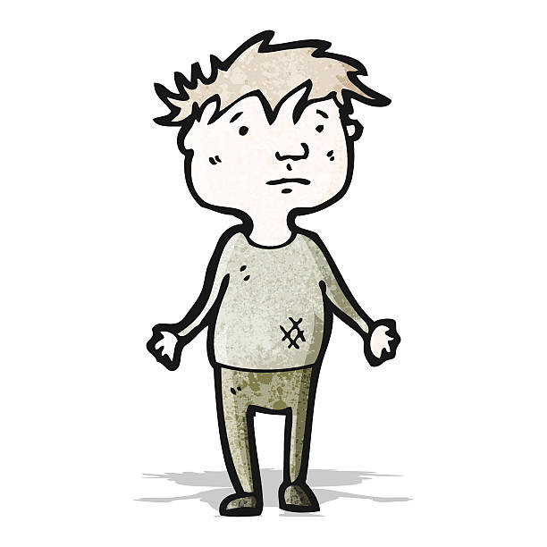

He once lived the life of a millionaire
Spending his  money he didn't care
Always taking his friends out for a good time
Buying champagne, gin and wine

But just as soon as his dough got low
He couldn't find a friend no place he goes

If he ever get his hands on a dollar again
He's gonna squeeze it and squeeze it till the eagle grins

Nobody wants him when he's down and out
In hid pocket not one penny
And  friends he hasn't any

And soon as he gets on hus feet again
Everybody is his long lost friend
It's mighty strange, without a doubt
But nobody wants him when he's down and out

You know folks, he once had a mansion
Sitting way up on the side of a hill
He'd give champagne and caviar parties
Just for fun and to get a thrill

But the wrong folks made it in his town
They finally got in
And now he can't muscle up enough money
To buy a shot of gin

But you know, if he ever get his hands on a dollar again
He's gonna squeeze it and squeeze it
And squeeze it till the eagle grins

It's mighty strange without a doubt
But nobody wants him, nobody needs him
Nobody wants him when he's down and out